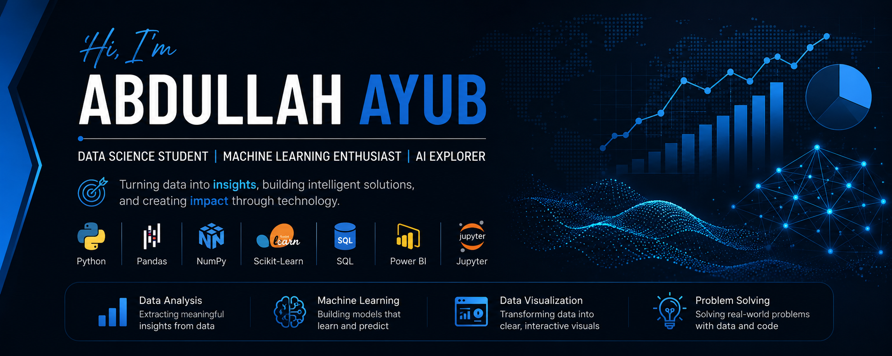

<!-- 🌟 Banner -->

  

# Hi there! I'm Abdullah Ayub

**BS Data Science** student at **University of the Punjab, PUCIT**
Interested in **Data Analytics, Machine Learning, Artificial Intelligence, and Business Intelligence**
Passionate about turning data into insights and building impactful solutions

---

## About Me

I'm a Data Science student with a strong interest in data-driven problem solving and intelligent systems.

My journey began with **C and C++**, where I developed a solid foundation in programming and logical thinking. As my interest in data grew, I transitioned into **Python**, exploring data analysis, visualization, machine learning, and AI applications.

I enjoy building practical projects, analyzing datasets, creating dashboards, and experimenting with emerging technologies. My goal is to continuously learn, build, and contribute while growing as a Data Scientist.

---

## Tech Stack & Tools

  
  
  
  
  
  
  
  
  
  

### Tools

  
  
  
  
  

---

## Current Focus

* Building end-to-end Machine Learning projects
* Exploring AI-powered applications and LLMs
* Creating interactive Power BI dashboards
* Strengthening Data Analysis and Visualization skills
* Improving model evaluation and feature engineering techniques
* Expanding my portfolio with practical real-world projects

---

## Featured Projects

| Project                            | Tech                                     | Description                                                                    |
| ---------------------------------- | ---------------------------------------- | ------------------------------------------------------------------------------ |
| Cricket Player Stats Prediction | Python, Pandas, NumPy, Scikit-Learn      | Predicting cricket player performance using machine learning.                  |
| Fitness Chatbot                 | Python, Groq                             | AI-powered chatbot for fitness-related guidance and queries.                   |
| RAG Chatbot                     | Python, Scikit-Learn, Groq               | Retrieval-Augmented Generation chatbot with PDF document support.              |
| Car Price Analysis              | Python, Pandas, Matplotlib, Scikit-Learn | Data analysis and predictive modeling of car prices.                           |
| Tic Tac Toe                     | C++                                      | Console-based game demonstrating programming fundamentals and problem-solving. |

👉 **Explore all repositories:** https://github.com/mianxabdullah?tab=repositories

---

## Areas of Interest

* Data Analytics
* Machine Learning
* Artificial Intelligence
* Data Visualization
* Business Intelligence
* Predictive Modeling
* Problem Solving

---

## GitHub Stats

  
  

---

## Connect With Me

* LinkedIn: https://www.linkedin.com/in/mianxabdullah
* Email: [mian.abdullah.ayub@gmail.com](mailto:mian.abdullah.ayub@gmail.com)
* Portfolio: https://github.com/mianxabdullah

---

> ⚡ *Code. Learn. Build. Improve.*
